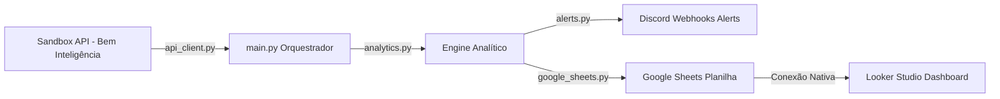

# FrostGuard AI - Manutenção Preditiva & Eficiência Térmica (Dale Sorvetes)

Este repositório contém a solução **FrostGuard AI**, desenvolvida para o desafio de manutenção preditiva industrial da **Dale Sorvetes** durante o **Hackathon BEM Inteligência**.

A plataforma realiza o processamento contínuo de dados elétricos e térmicos coletados em tempo real de sensores industriais, calcula métricas de saúde operacional e riscos de perda térmica, e disponibiliza relatórios integrados via **Google Sheets** e **Looker Studio**, além de disparar alertas automáticos e instantâneos para canais de operação via **Discord**.

---

## 🚀 Como Rodar o MVP (Passo a Passo)

### 1. Pré-requisitos
Certifique-se de ter o Python 3.8+ instalado em sua máquina.

### 2. Instalação das Dependências
Instale as bibliotecas necessárias executando o comando abaixo no terminal da pasta do projeto:
```bash
python -m pip install -r requirements.txt
```

### 3. Configuração do `.env`
Renomeie o arquivo `.env.example` para `.env` e configure suas chaves:
- `API_KEY`: Insira a chave exclusiva fornecida pelo hackathon (por padrão, o código já vem configurado com a chave pública do sandbox).
- `DISCORD_WEBHOOK_URL`: Crie um webhook nas configurações de um canal do Discord e insira o link aqui para habilitar os alertas em tempo real.
- `GOOGLE_SHEET_NAME`: O nome da planilha que você deseja preencher.

### 4. Executando o Orquestrador com Menu Interativo (Perfeito para Apresentação)
Rode o script principal para simular falhas e mostrar alertas na apresentação do pitch:
```bash
python main.py
```
O script iniciará no modo interativo. Você poderá escolher rodar dados normais em tempo real da fábrica ou simular anomalias (falhas elétricas ou térmicas) para demonstrar aos avaliadores no pitch.

### 5. Executando o Daemon de Monitoramento Real em Tempo Fiel (Modo Produção)
Para rodar a ferramenta em segundo plano, monitorando de forma contínua e silenciosa os dados em tempo real da fábrica (sem menus ou simulações):
```bash
python monitor.py
```

### 6. Executando Testes de Validação Rápida
Para realizar um teste automatizado pontual que executa 3 cenários operacionais seguidos e valida o processador analítico:
```bash
python test_workflow.py
```

---

## 🛠️ Como Funciona o Core Analítico (Algoritmos e Regras)

### A. Desequilíbrio Trifásico (NEMA)
O desequilíbrio de corrente ou tensão entre as fases ($A, B, C$) de motores e compressores é calculado de acordo com a norma NEMA:
$$\text{Desequilíbrio (\%)} = \frac{\text{Desvio Máximo em relação à Média}}{\text{Média Trifásica}} \times 100$$
- **Desequilíbrios > 10%** representam alta severidade, provocando fadiga precoce dos enrolamentos do motor e gerando picos de calor.

### B. Score de Saúde Operacional (0 - 100%)
Reflete a saúde geral do compressor através de uma média ponderada de indicadores elétricos e térmicos:
1. **Desequilíbrio de Corrente (Peso 35%)**: Penaliza de forma quadrática/linear valores acima de 5%.
2. **Desequilíbrio de Tensão (Peso 20%)**: Penaliza desvios elétricos acima de 1%.
3. **Flutuação de Tensão Nominal (Peso 15%)**: Mede o desvio em relação à tensão nominal da rede (220V).
4. **Fator de Potência (Peso 15%)**: Penaliza valores abaixo do limite regulatório nacional de 0,92 (evitando tarifas e multas de energia reativa excedente).
5. **Temperatura do Compressor (Peso 15% - se disponível)**.

### C. Previsão de Prejuízo Financeiro Operacional (R$)
Com base no valor total do estoque da câmara fria (ex: R$ 65.000 em sorvetes), estimamos o prejuízo cumulativo em tempo real se a temperatura romper a barreira crítica de degradação térmica ($-10^\circ\text{C}$):
$$\text{Prejuízo Previsto} = \text{Valor do Estoque} \times \text{Fator de Temperatura} \times \frac{\text{Tempo acima do limite (minutos)}}{240}$$
- A perda total ($100\%$ do valor do estoque) é projetada para ocorrer caso a temperatura permaneça crítica por mais de **4 horas (240 minutos)**, tempo limite antes do derretimento completo e perda irreversível da textura do sorvete.

---

## 📊 Arquitetura de Dados & Visualização no Looker Studio

O fluxo foi desenhado para ser econômico, rápido e altamente escalável para apresentação (Pitch):



### Passo a Passo para conectar o Looker Studio:
1. Acesse o [Looker Studio](https://lookerstudio.google.com/).
2. Clique em **Criar** > **Fonte de dados**.
3. Selecione o conector **Planilhas Google** e escolha a sua planilha `FrostGuard_Data` (compartilhada previamente com sua Conta de Serviço do Google Cloud).
4. No Dashboard, crie:
   - Um gráfico de linhas relacionando a data/hora (`timestamp`) com a `temp_camara`.
   - Um cartão de score mostrando a média do `health_score`.
   - Um gráfico de barras demonstrando o consumo e fator de potência por compressor.
   - Um indicador com o `prejuizo_previsto` acumulado.

---

## 👥 Equipe
Desenvolvido para o **Hackathon BEM Inteligência / Dale Sorvetes**.
*FrostGuard AI - A inteligência que protege a qualidade do seu sorvete e a saúde de suas máquinas.*
